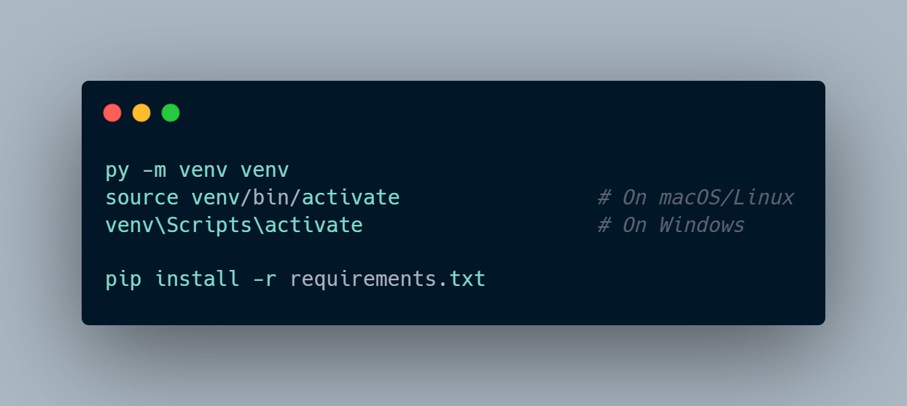
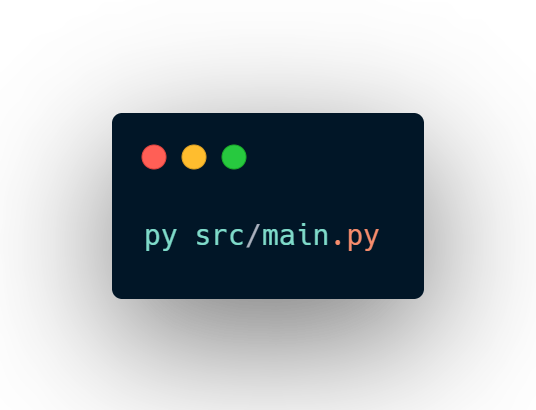
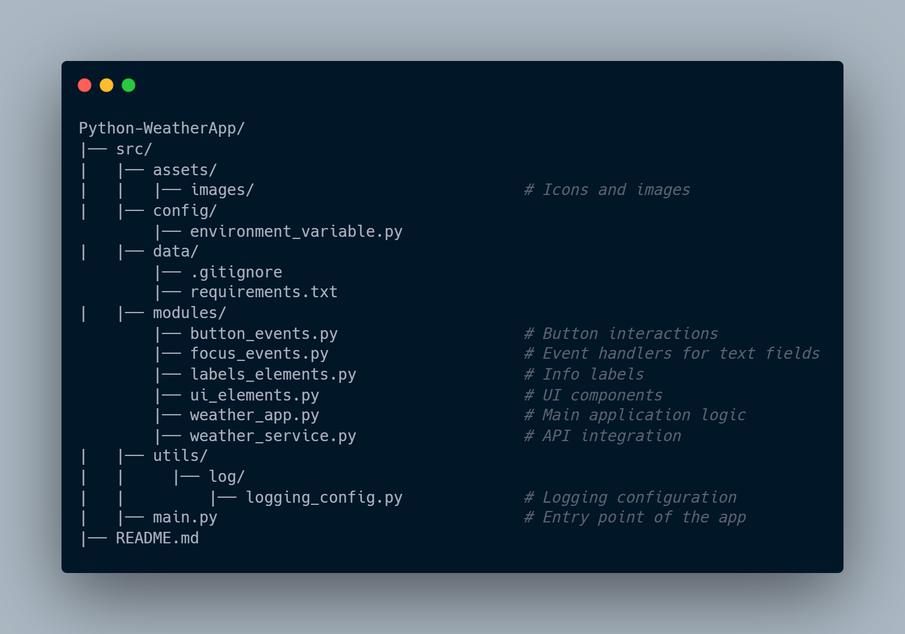

# 🌤️ Banana's Weather App

A simple weather application built with Python and Tkinter that fetches real-time weather data using an API.

## 📌 Features
- 🌎 Get weather updates by **city name** or **ZIP code**.
- 🌦️ Displays **temperature, humidity, wind speed, and pressure**.
- 💻 User-friendly graphical interface with Tkinter.
- 🕓 Shows **local time** of the selected location.

## 🔧 Installation

### 1️⃣ Clone the Repository

### 2️⃣ Install Dependencies
Make sure you have Python 3 installed. Then, set up a virtual environment and install dependencies:

### 3️⃣ Run the Application

## 📝 Project Structure

## 🖥️ Technologies Used
🔹Python 🐍
🔹Tkinter 🎨
🔹Requests 🌐
🔹Logging 📥
🔹PIL 🖼️

## 📃 License
This project is licensed under the MIT License - see the LICENSE file for details.